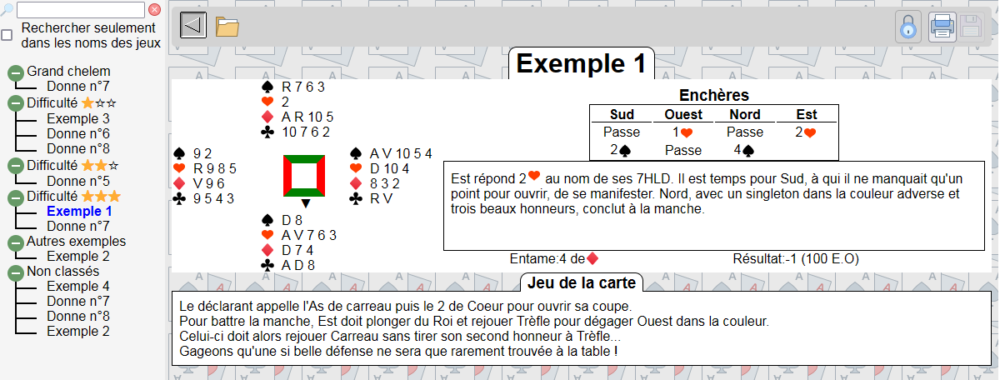

<<h1>[Cahier de Bridge](http://jeu-bridge.fr/)</h1>

## Introduction

J'ai écrit ce logiciel Open-source suite à une demande de ma sœur qui enseigne le bridge à des débutants. Elle utilise un cahier pour noter les donnes qu'elle commente avec ses élèves et passe beaucoup de temps à transcrire ses notes manuscrites en support de cours.
J'ai donc créé cette application pour qu'elle puisse:

1. Transcrire au propre ses notes
2. Les sauvegarder
3. Les imprimer
4. Et même éventuellement les partager en ligne avec ses élèves.

A la date de Janvier 2025, l'application est fonctionnelle et utilisable en mode mono-utilisateur. La roadmap est la suivante:

-   [x] Editeur de mains de bridge
-   [x] Classement dans un arbre de sélection
-   [x] Editeur de l'arborescence de tri
-   [x] Impression des mains
-   [x] Sauvegarde de mains au format SQL
-   [x] Sauvegarde de la base de donnée
-   [x] Mise en ligne sur Github et npm
-   [ ] Fichiers d'aide (en cours..)
-   [ ] Restauration de la base
-   [ ] Contrôle d'accès multi-utilisateurs
-   [ ] Undo-Redo (Possibilité d'annuler une action)
-   [ ] Tutoriels vidéos
-   [ ] Version anglaise

[Informations sur l'installation](./install.md)

[Prise en main du logiciel](./interface.md)

Vous pouvez me payer un café ou des croquettes pour le chat sur [ma page Tipeee](https://fr.tipeee.com/createur-open-source/)
