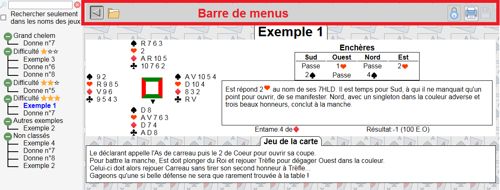
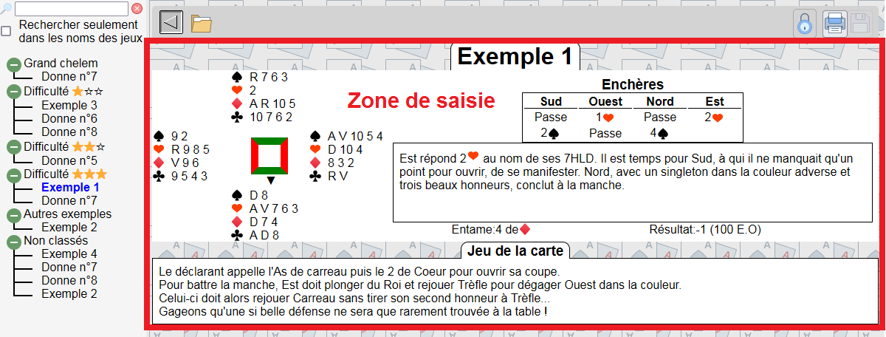

# Cahier de Bridge

Cahier de note pour donnes de bridge

J'ai écrit ce logiciel suite à une demande de ma sœur qui enseigne le bridge à des débutants. Elle utilise un cahier pour noter les donnes qu'elle commente avec ses élèves et passe beaucoup de temps à transcrire ses notes manuscrites en support de cours.
J'ai donc créé cette application pour qu'elle puisse:

1. Transcrire au propre ses notes
2. Les sauvegarder
3. Les imprimer
4. Et même éventuellement les partager en ligne avec ses élèves.

Contrat remplis....

Après installation de logiciel vous vous retrouvez devant l'écran ci-dessus.
Vous remarquez en haut une barre de menu

à gauche un arbre de navigation qui permet de classer les jeux et rechercher une ou plusieurs donnes

et au milieu une zone d'affichage qui permet de voir les données éventuellement de les éditer les modifier

Commençons donc par la barre de menu:
| Bouton | Usage |
|:-:|---|
|| ouvrir et fermer l'arbre de navigation |
|| Gérer les jeux |
