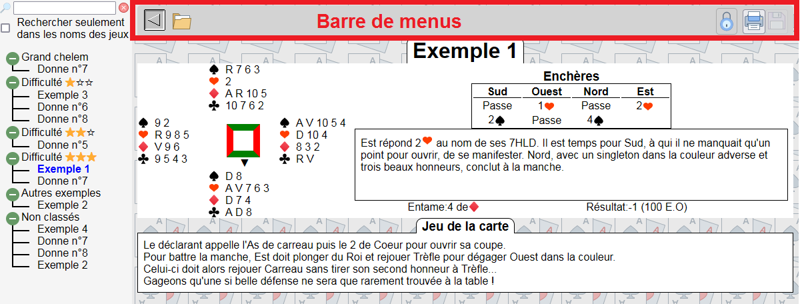
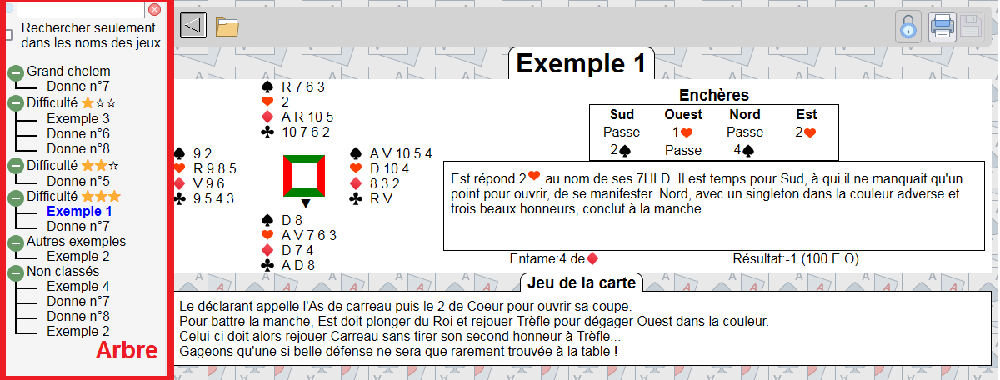
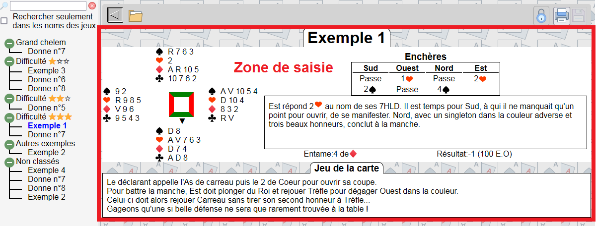
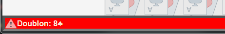
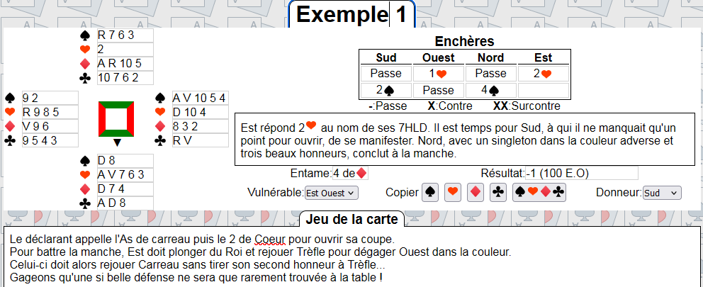
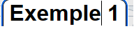
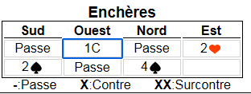
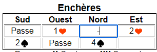
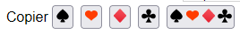

# Description de l'interface

Après [installation](./install.md) du logiciel vous vous retrouvez devant l'écran ci-dessus.

Vous remarquez en haut une barre de menu

| Bouton | Usage |
|:-:|---|
|| ouvrir et fermer l'arbre de navigation |
|| Gérer les jeux |
|| Liens vers des pages d'aide |
|| :heavy_plus_sign:**IMPORTANT**:heavy_plus_sign: Bascule entre le mode 'Édition' et le mode 'Consultation' |
|| Imprimer la main affichée, ou les mains sélectionnées dans l'arbre par ctrl-clic |
|| Sauvegarder les modifications |

A gauche un arbre de navigation qui permet de classer les jeux et rechercher une ou plusieurs donnes

et au milieu une zone d'affichage qui permet de voir les données éventuellement de les éditer les modifier

Enfin, en bas de l'écran, se trouve une barre de status, qui

-   réagit au passage de la souris sur les commandes en donnant des informations détaillées
-   Indique qu'une action s'est bien déroulée
-   ou au contraire qu'une erreur est détecté: 

## Interactions en mode consultation 

-   Cliquez dans la barre de recherche pour sélectionner un jeu par son nom ou par son contenu

-   Click dans l'arbre pour ouvrir/fermer un dossier, pour ouvrir un jeu

-   ctrl-click dans l'arbre pour sélectionner plusieurs jeux avant de les imprimer

-   Cliquez sur l'icône  pour imprimer la donne

## Interactions en mode édition 

En plus des actions ci-dessus, vous pouvez:

### Dans la zone centrale (édition des jeux)

-   Cliquer directement sur une distribution, un commentaire, le titre de jeu, pour les modifier. Une fine bordure grise encadre les contenus éditables.
-   Pour modifier le nom d'un jeu, cliquez dans le titre en haut de la zone de saisie. 
-   Dans la zone des enchères, vous pouvez utiliser
    -   P C K T comme raccourcis pour Pique Coeur Carreau Trèfle.
    -   X pour 'Contre'
    -   XX pour 'Surcontre'
    -   Le signe '-' pour 'Passe'
    -   Exemple:  

Les boutons  permettent de copier dans le presse-papier les caractères **♠ ♥ ♦ ♣** pour ensuite, avec ctrl-v, les coller dans votre texte.

Lorsque vous remplissez une couleur, les espaces seront automatiquement ajoutés par le logiciel: AR105 -> A R 10 5

Lorsque vous créez une nouvelle donne, un automatisme complète le jeu s'il reste 13 cartes à attribuer sur un des joueurs (généralement Sud).

 **N'oubliez pas de sauvegarder vos modifications.** 

### Dans la zone de tri à gauche (édition de l'arbre)

Les modifications se font ensentiellement par Glisser-Lâcher ('Drag & Drop') avec la souris:

-   Faire glisser l'image  sur un dossier pour créer un sous-dossier

-   Faire glisser l'image  sous les dossier, dans la zone 'Non-classés' pour créer un dossier

-   Faire glisser un dossier ou un sous-dossier VERS l'image  pour effacer un dossier. **CECI N'EFFACE PAS LE CONTENU DU DOSSIER**. Les jeux contenus dans le dossier effacé sont déplacés vers son parent ou vers la zone 'Non-classés'

-   Faire glisser un jeu vers l'image  **EFFACE CE JEU**. Cette opération est irréversible. Un mécanisme 'Undo-redo' est prévu dans la roadmap.

-   Cliquez dans le nom du dossier pour le modifier

-   Pour déplacer un jeu dans un dossier ou le remettre en 'Non-classé', faire glisser son nom à l'endroit choisi.

-   Pour placer un jeu dans plusieurs dossier, appuyez sur la touche MAJ ('Shift'), et le faire glisser à l'endroit désiré pour la copie.

-   NOTE: Pour modifier le nom d'un jeu, cliquez dans le titre en haut de la zone de saisie. 
